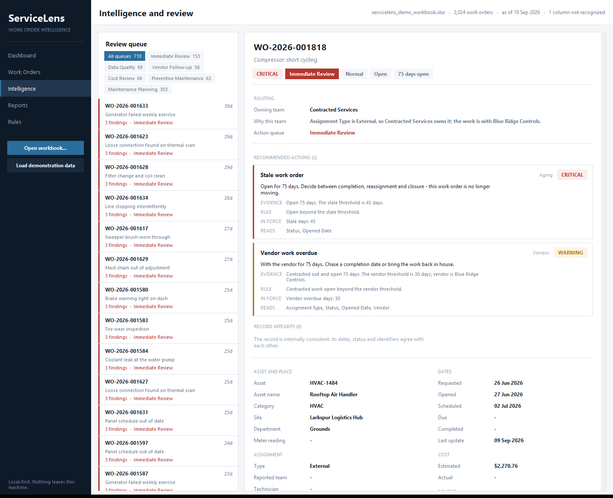
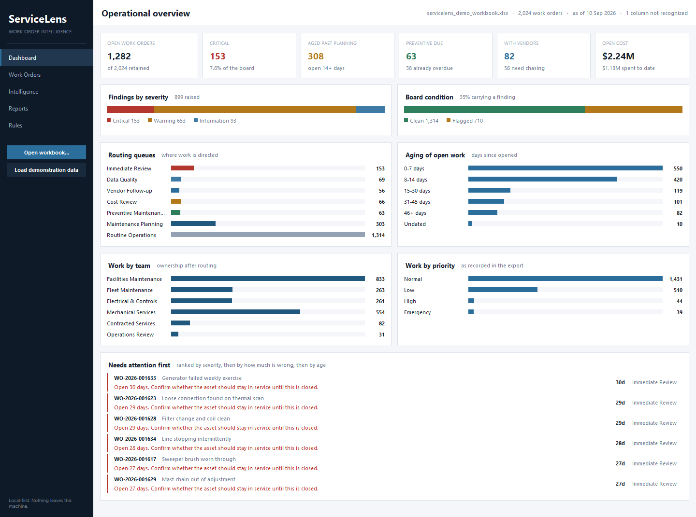
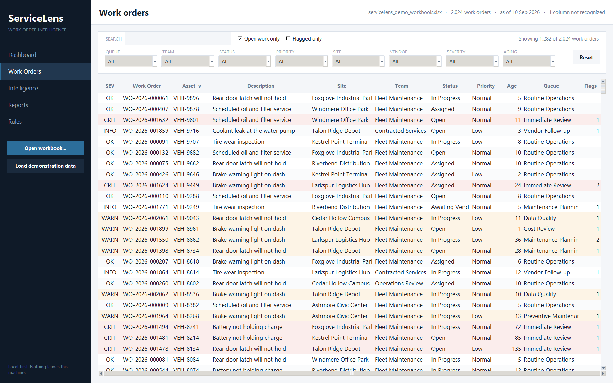
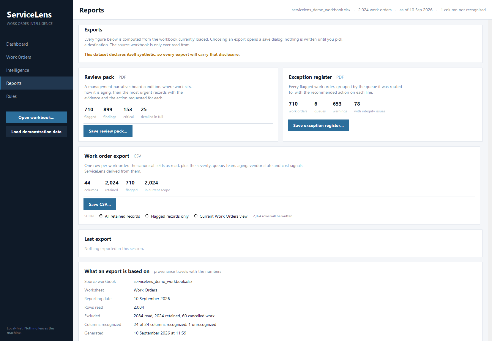
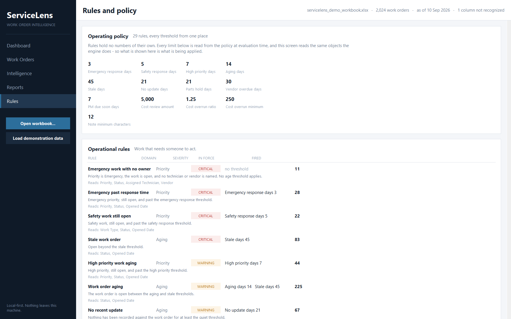

# ServiceLens

**Work Order Intelligence** — a local-first desktop application that turns an Excel export of maintenance work orders into operational dashboards, exception queues, routing recommendations and management reports. No server, no database, no cloud service, no third-party packages.

[](https://github.com/nickreid524-alt/ServiceLens/actions/workflows/ci.yml)


**2,084 synthetic work orders · 29 intelligence rules · 353-test suite · zero runtime dependencies**



> **All data shown anywhere in this repository is synthetic.** Every work order, asset, site, technician and vendor is generated by [`servicelens/demo/generator.py`](servicelens/demo/generator.py) from a fixed seed. Nothing here describes a real organisation.

---

## What ServiceLens does

Maintenance and service teams usually have a work order system that can export a spreadsheet, and a spreadsheet is where the analysis stops. ServiceLens picks up at that point:

1. **Reads the Excel export** directly — its own standard-library `.xlsx` reader, opened read-only.
2. **Resolves the columns** through an alias layer into one canonical schema, so `WO Number`, `Work Order` and `Job Number` all mean the same thing.
3. **Normalises** dates, money and vocabularies. Anything it cannot read becomes empty and is reported, never guessed.
4. **Evaluates 29 rules** — 12 on the integrity of each record, 17 on the work it describes — every threshold coming from a single policy object.
5. **Derives a severity and an action queue** for every work order, and names the team that owns it.
6. **Explains itself**: each finding carries the action requested, the evidence on the record, the rule, and the threshold in force.
7. **Presents** a dashboard, a filterable explorer, a review screen, and a live rule catalogue.
8. **Exports** a PDF review pack, a PDF exception register and an analysis-ready CSV — also written with the standard library.

## Why I built it

Operational teams often live in spreadsheet exports that are useful as raw data but poor as decision-support systems. Turning one into a decision tool usually means a web stack, a database and a deployment — which is exactly what a maintenance supervisor with a spreadsheet and a laptop does not have.

ServiceLens is an argument that the gap can be closed with a single Python installation. The interesting engineering is in what that constraint forces: reading Office Open XML by hand, writing PDF by hand, and keeping every piece of business logic testable without a window open.

## Application workflow

```
Excel workbook (.xlsx)
      │
      ▼
 schema detection ─── header row located; aliases resolved to canonical columns
      │
      ▼
 normalisation ────── dates, money, vocabularies; gaps reported, not guessed
      │
      ▼
 exclusions ───────── counted and reconciled: rows in = excluded + retained
      │
      ▼
 policy evaluation ── 12 integrity rules + 17 operational rules
      │
      ▼
 routing ──────────── team from the record; queue from the findings
      │
      ▼
 analytics ────────── totals, distributions, rankings
      │
      ├──────────────► desktop interface (tkinter/ttk)
      └──────────────► PDF and CSV reports
```

## Intelligence and review


The review screen answers *why* a record was flagged, in full. The example above is a contracted compressor repair, 75 days open. For each finding it separates:

| | |
|---|---|
| **Action** | what someone should now do — *"Chase a completion date or bring the work back in house."* |
| **Evidence** | the values on this record that triggered it — *"Contracted out and open 75 days. The vendor threshold is 30 days; vendor is Blue Ridge Controls."* |
| **Rule** | the general condition, in plain language |
| **In force** | the threshold actually being applied, read from the policy at that moment |
| **Reads** | the columns the rule consulted |

Above the findings, the routing block states which team owns the work and why (*"Assignment Type is External, so Contracted Services owns it; the work is with Blue Ridge Controls"*), and which action queue it landed in. A reviewer who disagrees with a flag can see at a glance whether the record is wrong or the policy is.

## Operations dashboard



Six headline figures, two proportional splits (findings by severity; clean against flagged), four distributions (routing queue, aging, owning team, priority) and a ranked list of what to look at first. On the demonstration corpus: 2,024 work orders retained, 1,282 open, 710 carrying at least one finding (35%), 153 of them critical.

## Work-order explorer



Search across nine fields at once, eight dropdown filters (queue, team, status, priority, site, vendor, severity, aging band) plus open-only and flagged-only toggles, over an eleven-column table sortable on every column. The derived columns — severity, owning team, queue, age, flag count — sit beside the source fields. Filtering is done by the domain's own `Filter` object, so what the table shows and what a CSV export contains can never disagree. Double-click a row to open it in the review screen.

## Reporting



Three exports, each previewed with the figures it will actually contain before anything is written:

| Export | Format | Contents |
|---|---|---|
| **Review pack** | PDF | Board condition, distributions, the highest-priority work orders, then the most urgent records in full with the evidence and action for each finding |
| **Exception register** | PDF | Every flagged work order under its queue, with the recommended action on each line |
| **Work order export** | CSV | 44 columns: the canonical fields as read, then the derived intelligence — severity, queue, team, age band, finding count, primary action, vendor state, cost signal. Scoped to all records, flagged only, or exactly what the explorer is currently showing |

A save dialog chooses the destination; nothing is written until then. Reports name the source file but never its directory. A workbook whose title row declares itself synthetic gets that disclosure on every export. **The source workbook is only ever read from** — there is no code path that opens it for writing, and the test suite asserts its hash is unchanged after every export.

## Rules and policy



The rule catalogue is rendered from the live `Rule` objects and the policy in force. There is no second description of a rule anywhere in the interface, so the screen cannot drift from the engine: change a threshold in [`config.py`](servicelens/config.py) and this screen shows the new value on the next launch, along with how many times each rule fired on the loaded workbook.

- **12 record-integrity rules** ([`domain/integrity.py`](servicelens/domain/integrity.py)) — is the record consistent enough to act on? Missing identifiers, duplicate numbers, impossible dates, a completion date on open work.
- **17 operational rules** ([`domain/directives.py`](servicelens/domain/directives.py)) — does the work need someone to act? Emergency response, safety work left open, aging, holds, vendor follow-up, cost approval and overruns, preventive maintenance.
- **Seven action queues** — Immediate Review, Data Quality, Vendor Follow-up, Cost Review, Preventive Maintenance, Maintenance Planning, Routine Operations.
- **Six owning teams**, derived from the record: contracted work, the export's own team when recognised, then the asset category, then a review bucket for anything unresolved.

## Architecture

```
servicelens/
├── app.py, __main__.py       entry point: python -m servicelens
├── config.py                 the operating policy — every threshold, as data
├── analysis.py               the pipeline: normalise → exclude → assess → route → measure
│
├── ingestion/
│   ├── xlsx.py               read-only .xlsx reader on zipfile + ElementTree
│   ├── schema.py             canonical columns and the alias layer
│   └── normalization.py      strings → WorkOrder
│
├── domain/                   importable and testable without tkinter
│   ├── models.py             WorkOrder, vocabularies, teams, queues
│   ├── rules.py              the declarative Rule / Finding / RuleSet framework
│   ├── integrity.py          12 record-integrity rules
│   ├── directives.py         17 operational rules
│   ├── routing.py            team ownership; finding-driven queue routing
│   ├── filters.py            reconciled exclusions, search, filtering, ranking
│   └── metrics.py            dashboard aggregation
│
├── reporting/
│   ├── pdf.py                PDF writer and page layout, standard library only
│   ├── review_pack.py        the management PDF
│   ├── exception_register.py the per-queue PDF
│   └── csv_export.py         the flat CSV
│
├── ui/                       tkinter/ttk; imports downward only
│   ├── theme.py, widgets.py  palette, DPI scaling, Canvas charts
│   └── shell.py + one module per screen
│
└── demo/
    ├── generator.py          the reproducible synthetic corpus
    └── xlsx_writer.py        writes a real .xlsx package for the demo
```

Dependencies point one way: `ui → analysis → domain → ingestion`. The domain never imports the interface, and a test blocks `tkinter` at import time across every non-UI module to keep it that way.

## Engineering decisions

**Standard-library-only runtime.** No pandas, openpyxl, reportlab or GUI framework. This was a constraint chosen up front, not a limitation discovered later: the target user has a Python installation and a spreadsheet, and asking them to manage a virtual environment defeats the point. It also makes the interesting parts visible — the `.xlsx` reader resolves cell styles so dates come back as dates, and the PDF writer builds its own cross-reference table and measures text with Helvetica width tables.

**Canonical schema with an alias layer.** Every maintenance system exports the same handful of ideas under different names. ServiceLens declares one canonical column per idea plus the spellings it accepts, and everything downstream reads only the canonical name. Supporting a new export format is a data change in [`schema.py`](servicelens/ingestion/schema.py). Headers that cannot be placed are reported, not dropped.

**Rules as data.** A rule is a declarative object carrying its key, title, domain, severity, the condition, the action requested, the evidence template, the columns it reads and the thresholds it depends on. That is what lets a finding explain itself, lets the catalogue render from the real objects, and lets a test parse the rule source and assert every threshold a rule reads is one it declares.

**Domain-driven routing.** A queue is a list of decisions, so routing reads a finding's *domain* — vendor, cost, data quality — rather than its rule key. Severity is checked first: anything critical is an immediate review regardless of domain. A new rule joins the right queue by declaring its domain; the routing table does not change.

**Read-only source workbook.** The input is opened for reading and nothing else. Exports go where the user chooses, and the tests check the source file's hash before and after every export.

**Reproducible synthetic corpus.** `python -m servicelens.demo.generator` builds 2,084 work orders from 32 designed scenarios so every rule, queue, team and aging band has something in it and the exception rate lands near a plausible 35%. The seed fixes the shape — the same scenarios, sites, vendors and identifiers every run. Dates are relative to a reference date that defaults to the day of generation, so ages read correctly whenever the demo is built; pass `--reference YYYY-MM-DD` to pin them and get a byte-identical file. When ServiceLens reads any workbook it infers the reporting date from the data rather than the clock, ignoring isolated outliers, so a stored snapshot keeps reporting the ages it was exported with.

**Headless business logic.** Every module outside `ui/` runs without a display. The full analysis — ingestion, rules, routing, metrics, reports — is exercised by the test suite and by CI on Linux and Windows without tkinter ever being imported.

## Testing

**353 tests**, standard-library `unittest`, running in about a second:

```
python -m unittest discover -s tests -t .
```

Coverage by area: the `.xlsx` reader (sparse cells, shared and inline strings, date styles, both date systems, damaged files) · header aliases and missing-column reporting · value parsing and normalisation · the `WorkOrder` model and vocabularies · every integrity rule and every operational rule at its threshold boundary, both sides · team and queue routing, including that every domain reaches a queue · exclusion reconciliation, search, filtering and ranking · metrics · the synthetic generator, including that every rule fires and the exception rate stays inside its band · PDF structure, cross-reference offsets, text escaping, wrapping and page breaks · report content, CSV headers, row counts and derived fields · that the source workbook is byte-identical after export · and that no domain module imports tkinter.

The desktop interface itself is verified by hand. There is no GUI automation in the suite.

## Run locally

You need **Python 3.12+** and its bundled **tkinter** module — nothing else. The python.org installers for Windows and macOS ship tkinter; on Debian or Ubuntu it is a separate package: `sudo apt install python3-tk`.

```
git clone https://github.com/nickreid524-alt/ServiceLens.git
cd ServiceLens
python -m servicelens.demo.generator
python -m servicelens --demo
```

The first command writes `demo/servicelens_demo_workbook.xlsx` (about 200 KB, not committed). The second opens ServiceLens with it loaded. Other ways in:

```
python -m servicelens                       open with the empty state; load a workbook from the sidebar
python -m servicelens path\to\export.xlsx   open a workbook of your own
python -m servicelens --scale 1.5           check the layout at a display scaling you are not using
python -m unittest discover -s tests -t .   run the test suite
```

ServiceLens declares itself DPI-aware on Windows and sizes everything from the reported scaling factor, so it renders sharply at 100%, 125% and 150%.

## Synthetic data and privacy

Everything in this repository is synthetic or generic. The sites, vendors, technicians, assets, descriptions and every figure in every screenshot are produced by the generator from invented vocabularies in [`demo/corpus.py`](servicelens/demo/corpus.py). The rules and thresholds are a worked example of a maintenance policy, not a description of any organisation's. ServiceLens never sends data anywhere: there is no network code in the application.

## License

[MIT](LICENSE).
